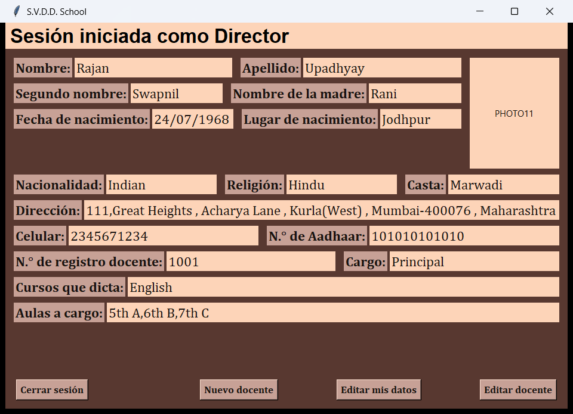

# S.V.D.D. School — Mantenimiento de software

Sistema de gestión escolar en **Python + Tkinter + SQLite**, usado como proyecto del curso **Evolución y Mantenimiento de Software (2026-II)**. Parte del proyecto abierto [rushgala27/School-Management-System](https://github.com/rushgala27/School-Management-System) (licencia MIT) y registra, versión por versión, los requerimientos de mantenimiento aplicados.

- Interfaz en español, con login para tres roles: **Director**, **Docente** y **Alumno**.
- El director ve sus datos, edita su información, da de alta docentes y edita sus datos.
- El docente ve sus datos, da de alta alumnos y edita sus datos.
- El alumno ve sus datos.
- Base de datos SQLite con 3 tablas: `StudentData`, `TeacherData` y `PrincipalData`.



## Cómo ejecutarlo

Requisitos: Python 3.10 o superior (en Windows ya trae Tkinter y SQLite).

```bash
git clone https://github.com/JersonCh1/svdd-school-mantenimiento.git
cd svdd-school-mantenimiento
pip install -r requirements.txt
python SchoolManagementSystem.py
```

En Linux también hace falta el paquete de Tk: `sudo apt install python3-tk`.

En Windows también se puede descargar el `.exe` de la sección **Releases** y ejecutarlo sin instalar Python.

### Usuarios de prueba

| Rol | Usuario | Contraseña |
|---|---|---|
| Director | `RajanUp12` | `RUpadhyay123` |
| Docente | `Darshi999` | `darshik@26` |
| Alumno | `Rushabh123` | `12345678` |

## Versiones

Cada versión es una etiqueta de Git, con un commit por requerimiento. El detalle (descripción, prioridad, tipo de mantenimiento y los problemas reales que aparecieron durante cada modificación) está en **[docs/MANTENIMIENTO.md](docs/MANTENIMIENTO.md)**.

| Versión | Requerimientos | Tipo |
|---|---|---|
| `v1.0` | Proyecto original | — |
| `v2.0` | R01 Validación de campos numéricos · R02 Navegación estable entre paneles · R03 Carga y vista previa de foto | Preventivo · Correctivo · Perfectivo |
| `v3.0` | Clasificación del mantenimiento según la intención (ISO/IEC 14764) | — |
| `v4.0` | R01 Navegación de ventana única · R02 Diseño responsivo (grid con pesos) · R03 Conexión única a SQLite (Singleton + WAL) | Correctiva · Perfectiva · Preventiva |
| `v4.1` | Interfaz en español | Perfectivo |

Para ver el sistema tal como estaba en una versión: `git checkout v2.0` (o `v1.0`, `v3.0`, `v4.0`, `v4.1`). Hasta la v4.0 la interfaz estaba en inglés, como en el original.

## Estructura

```
SchoolManagementSystem.py   punto de entrada
pantallas.py                login, paneles y formularios (diseño adaptable)   v4.0 R02
navegacion.py               ventana única con pantallas intercambiables        v4.0 R01
db.py                       conexión única a SQLite (Singleton, WAL)           v4.0 R03
validacion.py               solo dígitos en Mobile No. / Aadhaar Card No.      v2.0 R01
fotos.py                    selección, validación y miniatura de la foto       v2.0 R03
migraciones.py              migraciones idempotentes de testdata.db            v2.0
testdata.db                 base de datos de ejemplo (3 tablas)
tests/                      pruebas automáticas (unittest)
docs/                       registro de mantenimiento y capturas de evidencia
```

## Pruebas

```bash
python -m unittest -v
```

37 pruebas: validación numérica (incluido pegar desde el portapapeles), migraciones, fotos, conexión única (bloqueos reales con y sin WAL, inyección SQL, rutas), navegación de ventana única y diseño adaptable a escalas de pantalla de 1.0 y 1.75.

## Créditos y licencia

Proyecto original: **rushgala27** — [School-Management-System](https://github.com/rushgala27/School-Management-System). Las capturas originales están en `images/`.
Mantenimiento v2.0–v4.1: **Jerson Chura** (curso de Evolución y Mantenimiento de Software, 2026-II).
Licencia MIT (ver `LICENSE`).
