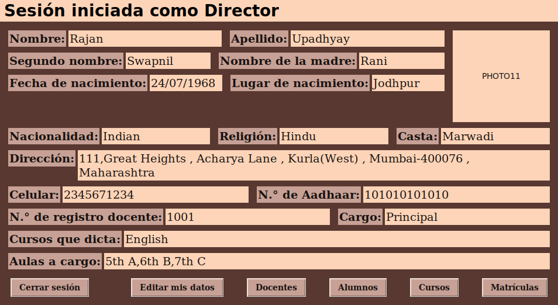
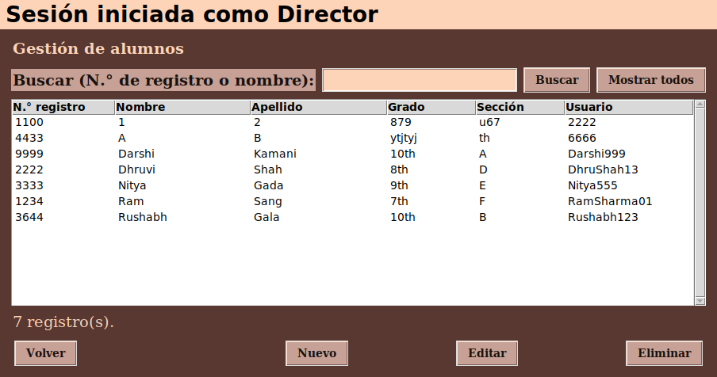

# S.V.D.D. School — Mantenimiento de software

Sistema de gestión escolar en **Python + Tkinter + SQLite**, usado como proyecto del curso **Evolución y Mantenimiento de Software (2026-II)**. Parte del proyecto abierto [rushgala27/School-Management-System](https://github.com/rushgala27/School-Management-System) (licencia MIT) y registra, versión por versión, los requerimientos de mantenimiento aplicados.

- Interfaz en español, con login para tres roles: **Director**, **Docente** y **Alumno**.
- El director ve y edita sus datos y gestiona docentes, alumnos, cursos y matrículas.
- El docente ve sus datos y gestiona alumnos, cursos y matrículas.
- El alumno ve sus datos.
- Cada gestión permite registrar, consultar (con búsqueda por N.° o nombre), actualizar y eliminar, con validación de los datos y sin duplicados.
- Base de datos SQLite con 5 tablas: `StudentData`, `TeacherData`, `PrincipalData`, `Curso` y `Matricula`, con claves foráneas y transacciones.




## Cómo ejecutarlo

Requisitos: Python 3.10 o superior (en Windows ya trae Tkinter y SQLite).

```bash
git clone https://github.com/JersonCh1/svdd-school-mantenimiento.git
cd svdd-school-mantenimiento
pip install -r requirements.txt
python SchoolManagementSystem.py
```

En Linux también hace falta el paquete de Tk: `sudo apt install python3-tk`.

En Windows también se puede descargar el `.exe` de la sección **Releases** y ejecutarlo sin instalar Python.

### Usuarios de prueba

| Rol | Usuario | Contraseña |
|---|---|---|
| Director | `RajanUp12` | `RUpadhyay123` |
| Docente | `Darshi999` | `darshik@26` |
| Alumno | `Rushabh123` | `12345678` |

## Versiones

Cada versión es una etiqueta de Git, con un commit por requerimiento. El detalle (descripción, prioridad, tipo de mantenimiento y los problemas reales que aparecieron durante cada modificación) está en **[docs/MANTENIMIENTO.md](docs/MANTENIMIENTO.md)**.

| Versión | Requerimientos | Tipo |
|---|---|---|
| `v1.0` | Proyecto original | — |
| `v2.0` | R01 Validación de campos numéricos · R02 Navegación estable entre paneles · R03 Carga y vista previa de foto | Preventivo · Correctivo · Perfectivo |
| `v3.0` | Clasificación del mantenimiento según la intención (ISO/IEC 14764) | — |
| `v4.0` | R01 Navegación de ventana única · R02 Diseño responsivo (grid con pesos) · R03 Conexión única a SQLite (Singleton + WAL) | Correctiva · Perfectiva · Preventiva |
| `v4.1` | Interfaz en español | Perfectivo |
| `v5.0` | R01 Gestión de estudiantes · R02 Gestión de docentes · R03 Gestión de cursos · R04 Registro de matrículas · R05 Búsqueda · R06 Validación de datos · R07 Persistencia e integridad | Perfectiva (R01–R05) · Correctiva (R06) · Preventiva (R07) |

Para ver el sistema tal como estaba en una versión: `git checkout v2.0` (o `v1.0`, `v3.0`, `v4.0`, `v4.1`, `v5.0`). Hasta la v4.0 la interfaz estaba en inglés, como en el original.

## Estructura

```
SchoolManagementSystem.py   punto de entrada
pantallas.py                login, paneles, formularios y gestión           v4.0 R02, v5.0
gestion.py                  reglas de alumnos, docentes, cursos y matrículas   v5.0 R01–R05
navegacion.py               ventana única con pantallas intercambiables        v4.0 R01
db.py                       conexión única a SQLite (Singleton, WAL)           v4.0 R03
                            transacciones y claves foráneas                    v5.0 R07
validacion.py               solo dígitos en celular / Aadhaar                  v2.0 R01
                            reglas de validación de cada registro             v5.0 R06
fotos.py                    selección, validación y miniatura de la foto       v2.0 R03
migraciones.py              migraciones idempotentes de testdata.db            v2.0, v5.0
testdata.db                 base de datos de ejemplo
tests/                      pruebas automáticas (unittest)
docs/                       registro de mantenimiento y capturas de evidencia
herramientas/               verificación automática de la interfaz real
DONDE-RETOMAR.md            estado actual y cómo seguir con la próxima versión
```

## Pruebas

```bash
python -m unittest -v                  # pruebas automáticas
python herramientas/verificar_app.py    # recorrido real de la interfaz (Windows)
```

92 pruebas: validación numérica (incluido pegar desde el portapapeles), migraciones, fotos, conexión única (bloqueos reales con y sin WAL, inyección SQL, rutas), navegación de ventana única, diseño adaptable a escalas de pantalla de 1.0 y 1.75 y, desde la v5.0, gestión de alumnos, docentes, cursos y matrículas, búsqueda, validación, duplicados, relaciones y transacciones (rollback y datos recuperados al reabrir la base).

En Linux, las pruebas de interfaz necesitan una pantalla; sin escritorio se pueden correr con `xvfb-run -a python -m unittest`.

## Créditos y licencia

Proyecto original: **rushgala27** — [School-Management-System](https://github.com/rushgala27/School-Management-System). Las capturas originales están en `images/`.
Mantenimiento v2.0–v5.0: **Jerson Chura** (curso de Evolución y Mantenimiento de Software, 2026-II).
Licencia MIT (ver `LICENSE`).
