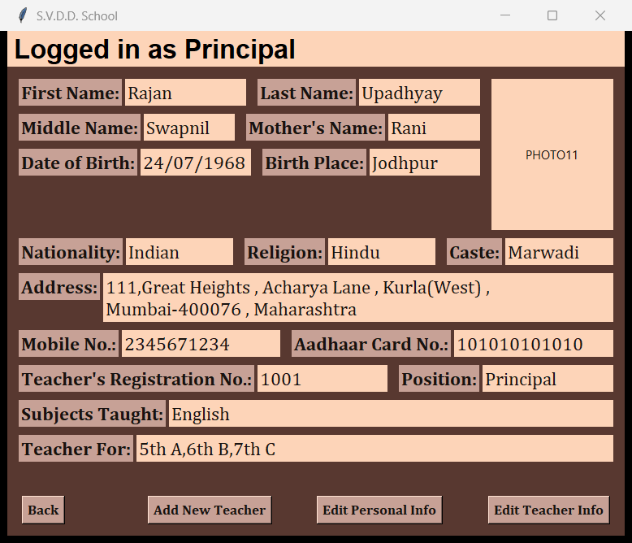
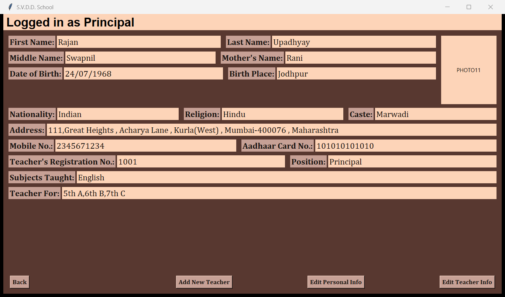
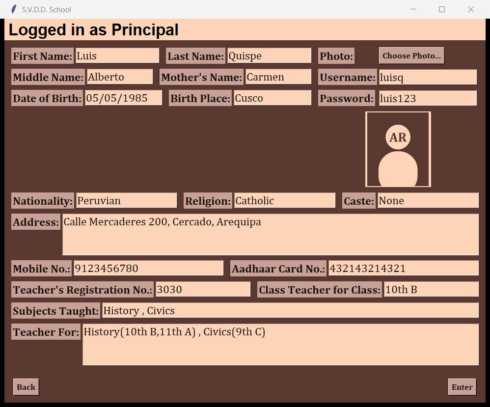
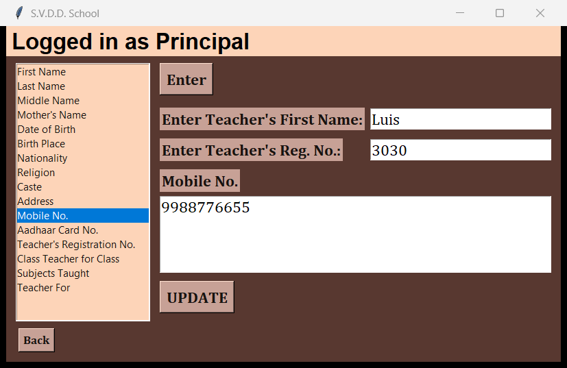
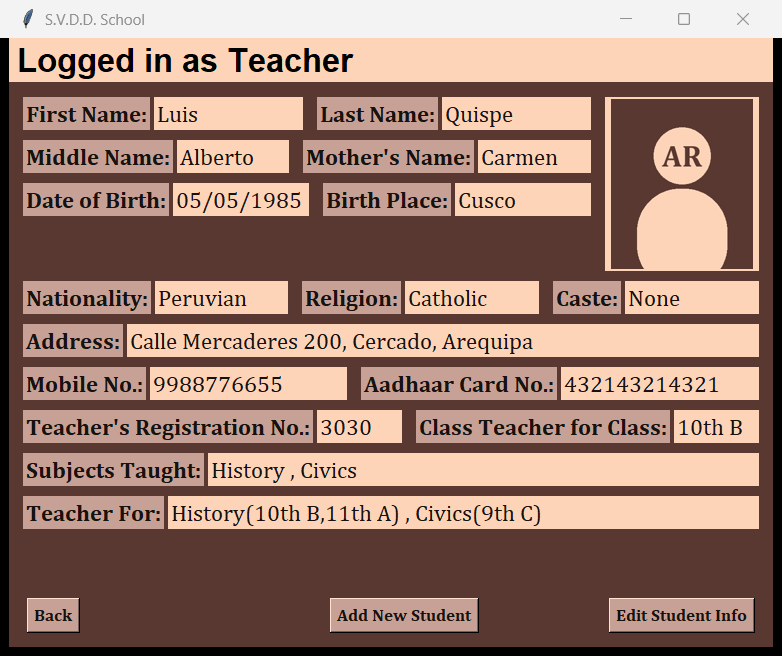
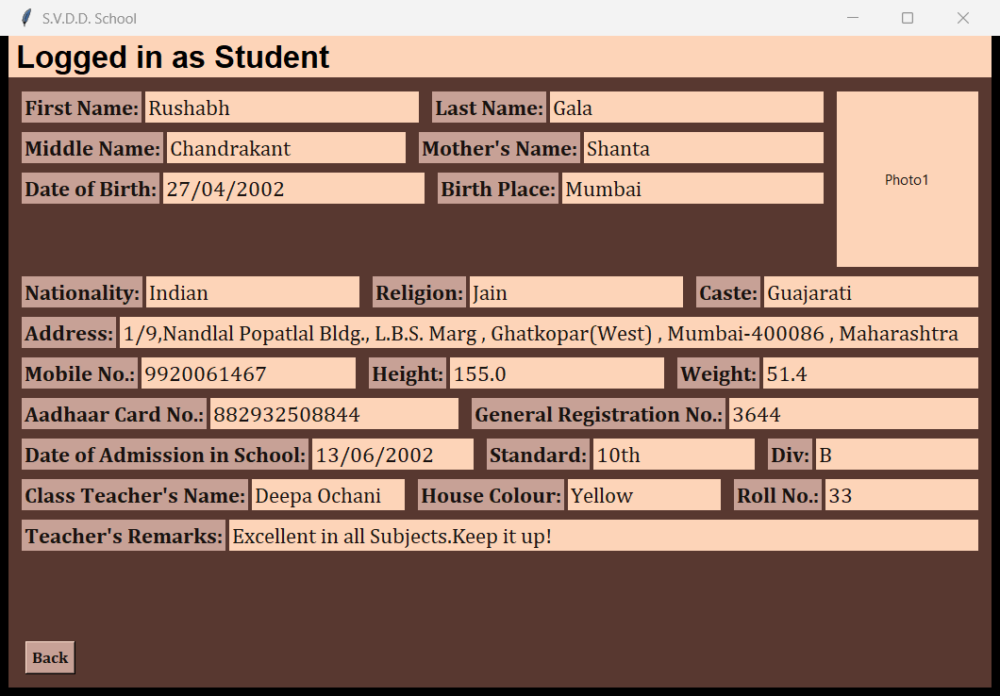
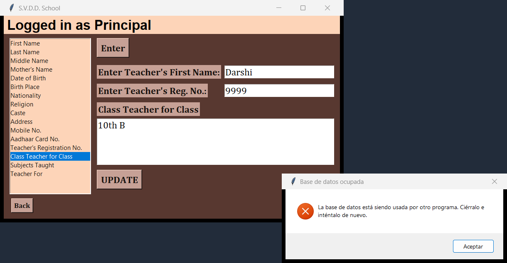

# Registro de mantenimiento — S.V.D.D. School

Curso: Evolución y Mantenimiento de Software (2026-II)
Proyecto base: [rushgala27/School-Management-System](https://github.com/rushgala27/School-Management-System) (Python + Tkinter + SQLite, licencia MIT) — etiqueta `v1.0`.

Clasificación del mantenimiento **basada en la intención** (ISO/IEC 14764):

| Tipo | Intención |
|---|---|
| Correctivo | Reparar un defecto que ya produce fallas observables. |
| Preventivo | Eliminar un defecto latente antes de que se convierta en falla. |
| Adaptativo | Mantener el software utilizable ante cambios de su entorno. |
| Perfectivo | Añadir capacidades o mejorar usabilidad/rendimiento sin que exista falla. |

---

## Versión 2.0 — etiqueta `v2.0`

### R01 — Validación de campos numéricos

- **Descripción:** Mobile No. y Aadhaar Card No. aceptaban letras y caracteres inválidos. Deben restringirse a solo dígitos (10 y 12) y mostrar un mensaje claro cuando el dato no es válido.
- **Prioridad:** Alta
- **Tipo de mantenimiento:** Preventivo — el dato inválido se guardaba sin error, pero dejaba registros corruptos que fallarían al usarse.
- **Commit:** `118b102`
- **Observaciones (problemas durante la modificación):**
  - El `validatecommand` de Tk evalúa el texto completo propuesto: al **pegar** un número con guiones (`8829-3250-8844`, el formato que ya había en la base) se rechazaba entero y el campo quedaba vacío. Hubo que interceptar `<<Paste>>` y limpiar los separadores antes de insertar.
  - La base ya tenía datos que no pasaban la validación: todos los Aadhaar con guiones y registros de prueba con letras (usuarios `2222`, `6666`, `3` y `5555`, este último duplicado). Se escribió una migración idempotente: quita guiones y deja en `NULL` los valores imposibles de recuperar.
  - El director tenía **dos celulares en un solo campo** (`2345671234/4657382910`); la migración conserva el primero.
  - Al probar la edición apareció un defecto previo: *Edit Teacher/Student Info* mapeaba "Aadhaar Card No." a la columna `ano`, que no existe (`OperationalError: no such column: ano`). Se corrigió a `adno`.
- **Evidencia:** 

### R02 — Navegación estable entre paneles

- **Descripción:** Al pasar entre *Add New Teacher*, *Edit Personal Info* y *Edit Teacher Info* se abrían ventanas duplicadas y la anterior no siempre se cerraba bien. El botón *Back* debe volver al panel correcto sin perder la sesión.
- **Prioridad:** Alta
- **Tipo de mantenimiento:** Correctivo — falla reproducible: cada clic abría otra ventana y se podía abrir un segundo panel de sesión desde el login.
- **Commit:** `56b2485`
- **Observaciones:**
  - Cada `Toplevel` volvía a llamar a `mainloop()`: había **8 bucles de eventos anidados** y cada ventana abierta apilaba uno más. Se dejó un solo `mainloop()` en la ventana raíz.
  - El login seguía visible durante la sesión, así que se podían abrir paneles dobles. Al ocultarlo, cerrar el panel con la **X** dejaba el proceso vivo sin ninguna ventana visible; hubo que asignar `WM_DELETE_WINDOW` para que la X haga lo mismo que *Back* (cerrar sesión y volver al login).
  - Con un usuario inexistente el login mostraba el error y luego se caía con `TypeError: 'NoneType' object is not subscriptable`.
  - En las pruebas, `winfo_exists()` lanzaba `TclError` al consultar una ventana de un intérprete Tk ya destruido (en lugar de devolver `False`); se protegió el registro de ventanas.
- **Evidencia:** usuario inexistente sin excepción y vuelta al login limpio tras *Back*:
  
  

### R03 — Carga y vista previa de foto

- **Descripción:** El campo Photo solo guardaba un texto de referencia (`PHOTO11`), no la imagen. Se implementa selector de archivo con miniatura y validación del formato antes de guardar.
- **Prioridad:** Media
- **Tipo de mantenimiento:** Perfectivo — capacidad nueva; no corrige una falla existente.
- **Commit:** `bb1a307`
- **Observaciones:**
  - Las tablas no tenían dónde guardar la imagen. `ALTER TABLE ... ADD COLUMN photo_blob BLOB` conserva los registros, pero **rompió todos los `INSERT ... VALUES` posicionales** (`table TeacherData has 20 columns but 19 values were supplied`). Se reescribieron con columnas explícitas y parámetros `?`; de paso, los apellidos con apóstrofo (`D'Souza`) ya no rompen el SQL.
  - Tk no lee JPG de forma nativa: se agregó Pillow (`requirements.txt`).
  - La extensión no basta: un `.txt` renombrado a `.png` pasaba el filtro del selector. Se valida el contenido con `Image.verify()`, el formato y un máximo de 2 MB.
  - La miniatura aparecía en blanco si el `PhotoImage` solo vivía en una variable local (Python lo libera); se guarda la referencia en el propio `Label`.
- **Evidencia:** archivo falso rechazado, miniatura en el alta y foto en el panel del docente:
  
  
  

---

## Versión 3.0 — etiqueta `v3.0`

Sin cambios de código: se agrega el campo **Tipo de mantenimiento** a cada requerimiento de la v2.0 (clasificación basada en la intención, arriba) y este registro al repositorio.

| Req. | Título | Tipo de mantenimiento |
|---|---|---|
| R01 | Validación de campos numéricos | Preventivo |
| R02 | Navegación estable entre paneles | Correctivo |
| R03 | Carga y vista previa de foto | Perfectivo |

---

## Versión 4.0 — etiqueta `v4.0`

Requerimientos nuevos. Cada uno lleva el **tipo de mantenimiento** (clasificación basada en la intención) y el **tipo de modificación**. Se implementó primero R03 porque R01 y R02 se apoyan en la conexión única.

### R01 — Navegación de ventana única

- **Descripción:** Cada botón (*Add New Teacher*, *Edit Personal Info*, *Edit Teacher Info*…) abría un `Toplevel` nuevo, que quedaba abierto detrás del panel. Se migra a una sola ventana raíz cuyas pantallas son `Frame` que se reemplazan entre sí.
- **Prioridad:** Alta
- **Tipo de mantenimiento:** Basada en la intención
- **Tipo de modificación:** Correctiva
- **Commit:** `0ee9792`
- **Observaciones:**
  - Un `Frame` no tiene `title()`, `geometry()` ni `protocol()`: todas esas llamadas, repetidas en cada ventana, tuvieron que salir, y el tamaño pasó a controlarse desde la ventana raíz.
  - Los formularios de edición **solo creaban el botón *Back* después de elegir un campo y pulsar *Enter***. Con `Toplevel` se podían cerrar con la X, pero dentro de la ventana única el usuario quedaba atrapado. *Back* existe ahora desde el inicio.
  - Tras editar un dato, el panel original seguía mostrando el valor viejo hasta volver a iniciar sesión. Ahora la sesión (rol, usuario y contraseña) vive en el navegador, y *Back* reconstruye el panel con los datos actualizados.
- **Evidencia:** panel y formulario de alta dentro de la misma ventana (sección R02).

### R02 — Diseño responsivo del panel de datos

- **Descripción:** El panel y los formularios ubicaban cada `Label`/`Entry` con `place(x, y)` en píxeles fijos. Con otra resolución, fuente o escala de Windows, los campos quedaban recortados o con márgenes vacíos. Se reemplaza por `grid()` con pesos (`columnconfigure`/`rowconfigure weight`), para que los campos se acomoden al tamaño de la ventana.
- **Prioridad:** Alta
- **Tipo de mantenimiento:** Basada en la intención
- **Tipo de modificación:** Perfectiva
- **Commit:** `32a8618`
- **Observaciones:**
  - Con la escala de Windows activa, las etiquetas se cortaban porque las fuentes crecían y las coordenadas no ("Mother's Nam", "Teacher's Registration No" y "Teache" en el login; ver la captura R01 de la v2). Además, el formulario de alta original medía 1000×1000 y no cabía en una pantalla de 864 px lógicos.
  - Las tres copias casi idénticas de cada pantalla (alumno, docente y director) obligaban a migrar cada widget tres veces. Se unificaron en una sola pantalla guiada por tablas de campos (~900 → ~410 líneas).
  - Con los valores a ancho mínimo 1, los datos cortos se partían en el tamaño mínimo ("Upadhy/ay", "24/07/1968" en dos líneas). Se les dio un ancho mínimo según el dato.
  - El primer `<Configure>` llega con ancho ≈ 1 antes de que `grid` reparta el espacio. Eso fijaba un `wraplength` de 40 px y la ventana se medía 190 px más alta de lo necesario. Ahora se ignoran esos anchos.
  - La pantalla de edición se medía antes de mostrar los campos, y el botón *UPDATE* quedaba cortado. Hay que volver a medir al mostrarlos. Además, cada *Enter* apilaba widgets nuevos sobre los anteriores; ahora se crean una sola vez.
- **Evidencia:** tamaño natural y ventana agrandada (la dirección pasa de 628 a 1218 px de ancho):
  
  
  
  
  
  

### R03 — Centralización de la conexión a SQLite

- **Descripción:** La conexión se abría con una ruta relativa, cada consulta concatenaba texto en el SQL y un bloqueo de la base terminaba en una excepción. Se centraliza en una clase única (Singleton) que gestiona una sola conexión compartida.
- **Prioridad:** Media
- **Tipo de mantenimiento:** Basada en la intención
- **Tipo de modificación:** Preventiva
- **Commit:** `b6fc424`
- **Observaciones:**
  - `sqlite3.connect("testdata.db")` es relativo a la carpeta desde donde se ejecuta. Al abrir el programa desde otra carpeta, **creaba un `testdata.db` vacío** y fallaba con `no such table: PrincipalData`. La ruta ahora es absoluta, y si el archivo no existe se avisa en lugar de crear uno vacío.
  - En modo de diario `DELETE` (el predeterminado), una lectura falla con `database is locked` mientras otro programa (por ejemplo, un visor de SQLite) tiene una escritura abierta. Con `PRAGMA journal_mode=WAL` las lecturas siguen funcionando; las escrituras aún esperan, así que se agregó `busy_timeout` y un mensaje claro en vez de la excepción. Ambos casos tienen prueba automática.
  - WAL crea los archivos `testdata.db-wal` y `-shm`, que se excluyeron de Git. Además, los cambios quedan en el `-wal` hasta el cierre: se verificó que cerrar la conexión los vuelca al archivo principal.
  - Los nombres de columna no se pueden pasar como parámetro `?`, así que se validan contra el esquema real (`PRAGMA table_info`).
  - Al parametrizar los `UPDATE` salieron tres defectos previos. Se decía "Updated Successfully" aunque ningún registro coincidiera. "General Registration No." no tenía columna asociada y lanzaba `NameError`. Y los paneles mostraban los valores entre llaves `{…}` porque le pasaban una tupla a `StringVar`.
- **Evidencia:** un visor externo mantiene una escritura abierta y la app avisa en vez de caerse:
  

### Resumen v4.0

| Req. | Título | Tipo de mantenimiento | Tipo de modificación |
|---|---|---|---|
| R01 | Navegación de ventana única | Basada en la intención | Correctiva |
| R02 | Diseño responsivo del panel de datos | Basada en la intención | Perfectiva |
| R03 | Centralización de la conexión a SQLite | Basada en la intención | Preventiva |
